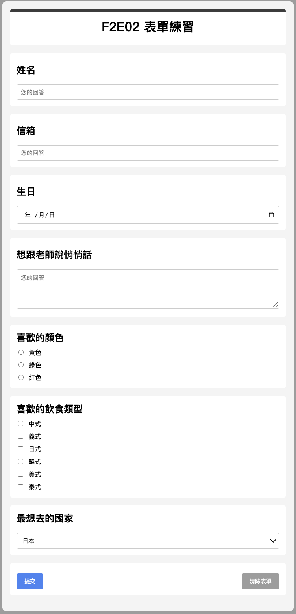

# 表單練習

這是我在前端工程課程中自行設計的 HTML 表單練習，主要學習如何用純 HTML + CSS 寫出互動式表單，包含：

## 📌 表單元素包含：

- 輸入文字欄位（姓名、信箱）
- 日期選擇器（生日）
- 多選題（checkbox）與單選題（radio）
- 下拉選單（select）
- 留言區（textarea）

## 🎨 使用技術

- HTML5 + CSS3（純手刻）
- 無框架、不依賴外部套件
- 嘗試不同區塊樣式設計與基礎美化

## 🖼️ 表單畫面展示

