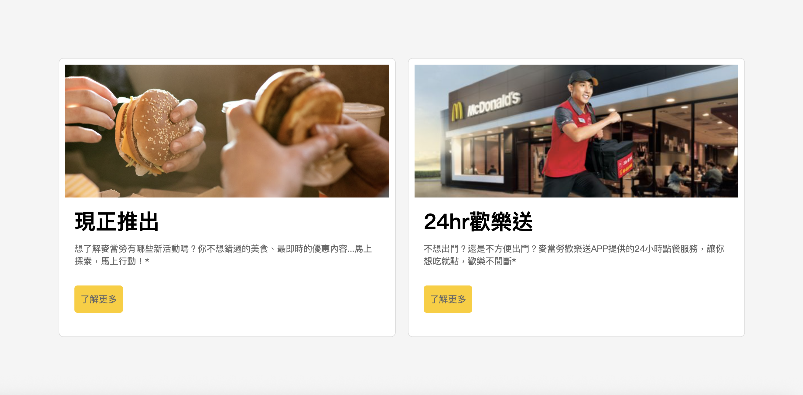

# inline 餐廳訂位網站排版

## 簡介

這是我在前端課程中完成的作業，模仿 McDonaldsCard 的排版與樣式，練習 HTML 和 CSS 的運用與切版能力。

## 使用技術

- HTML
- CSS

## 結構

- `index.html`：主要的 HTML 結構
- `style.css`：樣式設定

## 預覽畫面

## 學習重點 / 遇到的挑戰

- 練習如何排版與調整
- 嘗試使用 flex / grid 做出欄位排列
- 處理卡片內文字與圖片的對齊

## 備註

- 作業日期：2025/04
- 練習目的：純前端排版練習

僅供學習練習使用，無商業用途。
